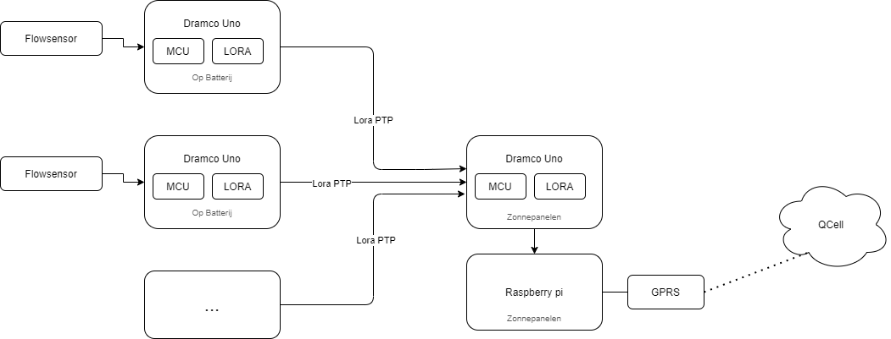
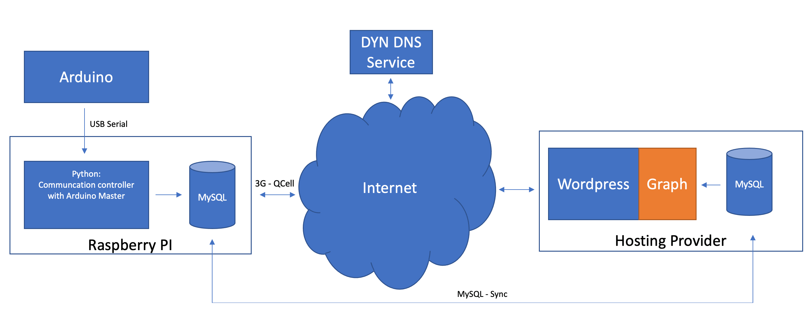

# Bachelorproject Debietmeter 

Dit is de algemene bescrhijving van de werking van de debietmeter. 

## Inhoud

- [Bachelorproject Debietmeter](#bachelorproject-debietmeter)
  * [Inhoud](#inhoud)
  * [Inleiding](#inleiding)
  * [Concept](#concept)
    + [Sensor](#sensor)
    + [Lora Connectie](#lora-connectie)
    + [GPRS modem](#gprs-modem)
    + [Voeding](#voeding)
    + [Website](#website)
      - [Concept Website](#concept-website)
      - [Uitwerking Website](#uitwerking-website)

## Inleiding

Dit debietmeter-project is deel van een ontwikkelingsproject van de organisatie Humasol, in samenwerking met Warme Gloed. De goal van dit project is om in Kunting - een dorpje in Gambia - een zonnepomp te installeren en het leindingetwerk uit te breiden. In een groep van 4 studenten zullen we een jaar lang dit prject technisch uitwerken. In de zomer van 2021 zullen we voor 9 weken naar Kunting trekken om alles te installeren.  

Als uitbreiding op dit project ontwerpen we een debietmeter. Deze zal ervoor zorgen dat de VDC (lokaal bestuur) het verbruik van de bevolking kan opvolgen, en gebruiken voor een betalingssysteem uit te werken. Ook zal 'The water departement' en universiteit van Gambia toegang hebben tot de data voor onderzoek. 

De planning kan op volgende link worden geraadpleegd  [Gantt chart](https://share.clickup.com/g/h/4dy0f-15/a6a5620b579de9b "Gantt chart"). 

## Concept 

Aan elke kraan die voor privé verbruik gebruikt wordt, wordt een flowsensor bevestigd. Deze flowsensor is bevestigd aant een darmco uno arduino met een Lora modem op bevestigd. Via Lora peer to peer connectie zal deze microcontroller het verbruik doorsturen naar de centrale arduino. Deze centrale arduino is een dramco uno arduino die de gegevens zal kunnen ontvangen en doorsturen naar de raspberry pi. De raspberry pi zal op zijn beurt de data verwerken en via een gprs module de website updaten, dit zal gebeuren via QCell network.  Op de website zal men kunnen raadplegen wat het verbruik is van elke famillie.

We hebben het project opgedeeld in verschillende repositories en zullen de definitieve samengevoegde code onder 'General' plaatsen. 

### Sensor

Momenteel zijn we een proefopstelling aan het maken met de goedkope sensor [YF-S401 Water Flow Sensor](https://www.tinytronics.nl/shop/nl/sensoren/vloeistof/yf-s401-water-flow-sensor "YF-S401 Water Flow Sensor").  

In Kunting zullen we gebruik maken van de 800 Series Low Power Flowmeter. Dit is een low power flowmeter die foodsafe is met een diameter van 8mm en op 3V3 werkt. De verdeler van deze flowmeter moeten we nog contacteren. 

### Voeding

De arduino uno heeft een spanning van 5-12V nodig. De 800 Series Low Power Flowmeter heeft maar 3.3V nodig. We zullen de arduino voeden door knoopcel batterijen (CR2032), en de sensor bevestingen aan de 3V3 pin. 

De centrale arduino met Raspberry Pi bevinden zich in een centraal oplaad hutje waar elektriciteit is op zonne energie.

### Lora Connectie 

Lora is een long range wide area netwerk. Via dit netwerk kunnen we aan langeafstandscommunicatie doen met weinig vermogen. Via radio frequentie 868 MHz( die voor IOT is vrijgehouden) zullen we onze data sturen van de nodes ( flowmeters) naar de gateway (de arduino bij de raspberry pi). Op de Dramco uno bordjes zit een lora module geïntegreerd. 

### GPRS modem 

Via een GPRS modem zullen we ervoor zorgen dat de Raspberry Pi toegang krijgt tot het mobiele netwerk.

### Website 

#### Concept Website 

Het is de bedoeling dat de bevolking, het lokaal bestuur en het water departement van Gambia het verbruik van Kunting kunnen raadplegen. We kozen ervoor om per dag het totaal verbruikte aantal liter per privé kraan beschikbaar te stellen. Het is minder interessant om de exacte tijdstippen weer te geven, aangezien de website zo simpel mogelijk moet blijven. Hierdoor zal het bestuur aan de hand van onze data kunnen berekenen wat de maandelijkse kost van water zal zijn. Qua front-end is het de bedoeling dat er een kaart wordt weergegeven op de startpagina en dat je op de locatie van bepaalde kraantjes zal kunnen klikken om specifiek het verbruik op die plek te bekijken en grafieken van op te vragen. Voor grafieken ben ik momenteel op zoekn naar een graphic plugin voor Wordpress. De plugin die mij momenteel het meeste aanspreekt is WPDatabases. De plugin die zou zorgen voor de kaart is dan Google Maps Placemarks. (Allemaal nog niet zeker).

Aangezien ik met kaarten wil werken, lijkt het me dan ook een goed idee om te werken met een relationele database. Op die manier heb ik de vrijheid om een tabel bij te houden met het kraannummer, datum en aantal verbruikte liters én daarnaast nog een tabel met het kraannummer en de gps coordinaten die hiermee overeenkomen. Van die tweede tabel zal de kaart plugin dan gebruik maken en die eerste tabel wordt voornamelijk gebruikt door WPDatabases. Het is de bedoeling dat deze relationele database volledig dubbel wordt bijgehouden zodat we op elk moment een volledige backup hebben. De database backup zal dus aanwezig zijn op de sd-kaart van de Raspberry Pi zelf. Dit worden mySQL databases die gesynchroniseerd zullen zijn. De database waarvan Wordpress zal gebruik maken via de plugins is de database die we zullen huren bij een externe hosting provider.

Het is ook de bedoeling dat we via DynDNS ervoor zorgen dat we ook vanuit België altijd toegang hebben tot de Raspberry Pi.

#### Uitwerking Website 

